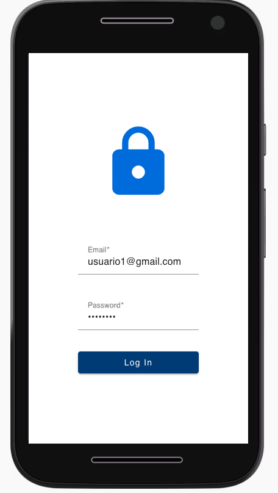
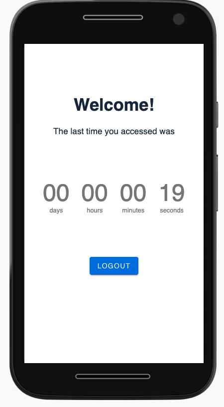
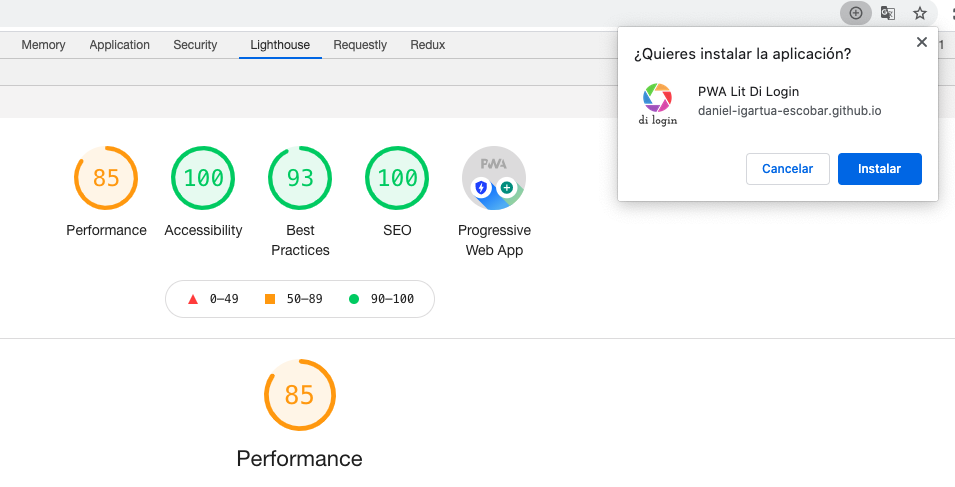

# PWA Lit Login
Bienvenido, puedes probar mi PWA desplegada haciendo click [aquí](https://daniel-igartua-escobar.github.io/pwa-lit-login-deploy/).
También puedes instalarla en tu escritorio o dispositivo movil pulsanso en la opción del navegador.

Los usuarios para probar la app son:
| Email | Contraseña |
|---------|--------|--------|
| usuario1@gmail.com | 12345678 |
| usuario2@gmail.com | 12345678 |
| usuario3@gmail.com | 12345678 |
| usuario4@gmail.com | 12345678 |
| usuario5@gmail.com | 12345678 |

**El tiempo transcurrido entre conexiones empieza a contar desde que se pulsa logout con cada usuario. Por defecto la primera vez que se entre con
los 3 primeros usuarios tendran 0segundos desde su última conexión.
## Cargar app en local
```bash
# requires node 10 & npm 6 or higher

npm install && npm start
```
## También puedes probar la build en local
```bash
# para probar la build en local
 npm install serve -g
 npm run build
 serve -s dist
```

## Scripts

- `start` runs your app for development, reloading on file changes
- `start:build` runs your app after it has been built using the build command
- `build` builds your app and outputs it in your `dist` directory
- `test` runs your test suite with Web Test Runner
- `lint` runs the linter for your project

## info
La app la he creado con la herramienta open-wc ya que me proporcionaba la base para crear mi PWA en lit-element, además de aportarme mas herramientas como un service worker.
La parte del servidor la he creado con node y la he subido a heroku. La PWA esta desplegada en github.

- Capturas:

</img>
</img>
</img>
